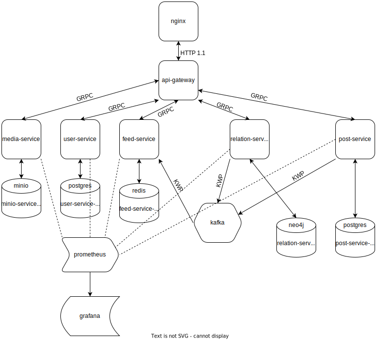

# Implementation of the primitive social network

## For what?
This is a learning project for practice with:
* Microservice architecture
* REST, GRPC
* Databases
  * SQL
    * Postgres
  * NOSQL
    * Redis
    * Neo4j (graph, for relations)
    * Minio (object storage, for media)
* Configuring
  * Nginx
  * docker, docker-compose
* Observability
  * ELK
  * Prometheus, Grafana
  * Jaeger
  * Pyroscope

## Architecture


## Repositories of all services
* List of all services group: https://github.com/stars/v1tbrah/lists/social-network
  * api-gateway: https://github.com/v1tbrah/api-gateway
  * user-service: https://github.com/v1tbrah/user-service
  * post-service: https://github.com/v1tbrah/post-service
  * relation-service: https://github.com/v1tbrah/relation-service
  * feed-service: https://github.com/v1tbrah/feed-service
  * media-service: https://github.com/v1tbrah/media-service

## Getting started
__Start__
```sh
make up
```
__Stop__
```sh
make down
```
__Open specification__

http://localhost/swagger/index.html

